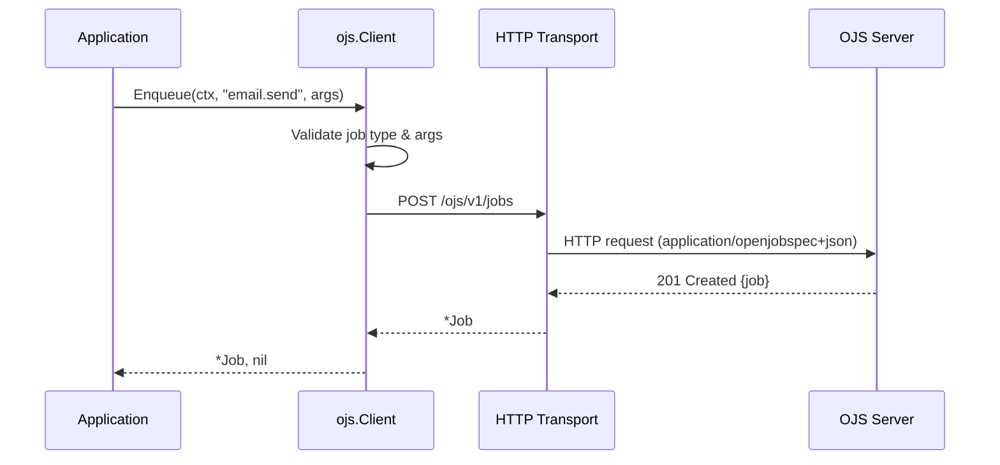
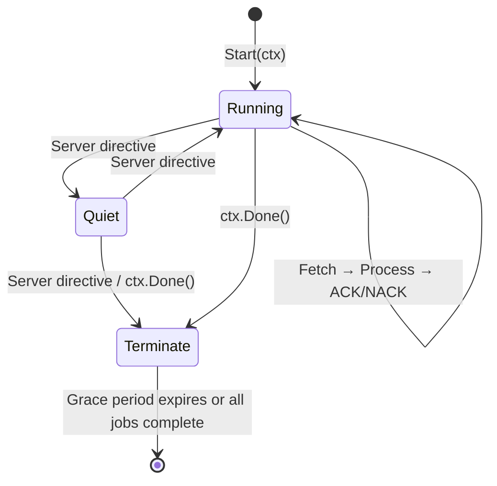

# ojs-go-sdk

[](https://pkg.go.dev/github.com/openjobspec/ojs-go-sdk)
[](https://go.dev/)
[](LICENSE)
[](https://github.com/openjobspec/ojs-go-sdk/actions/workflows/ci.yml)

The official Go SDK for [Open Job Spec (OJS)](https://openjobspec.org) -- a vendor-neutral, language-agnostic specification for background job processing.

## Features

- **Client**: Enqueue jobs, batch operations, workflow management, queue control
- **Worker**: Process jobs with configurable concurrency, middleware, and graceful shutdown
- **Workflows**: Chain (sequential), Group (parallel), Batch (parallel with callbacks)
- **Middleware**: Composable middleware chain for cross-cutting concerns
- **Structured errors**: Full `errors.Is`/`errors.As` support with OJS error codes
- **Zero dependencies**: Only the Go standard library

## Architecture

### Client → Server Flow



### Worker Lifecycle



### Middleware Chain (Onion Model)


## Installation

```bash
go get github.com/openjobspec/ojs-go-sdk
```

## Quick Start

### Enqueue a Job

```go
package main

import (
    "context"
    "log"
    "time"

    ojs "github.com/openjobspec/ojs-go-sdk"
)

func main() {
    client, err := ojs.NewClient("http://localhost:8080")
    if err != nil {
        log.Fatal(err)
    }

    job, err := client.Enqueue(context.Background(), "email.send",
        ojs.Args{"to": "user@example.com"},
        ojs.WithQueue("email"),
        ojs.WithRetry(ojs.RetryPolicy{MaxAttempts: 5}),
        ojs.WithDelay(5 * time.Minute),
    )
    if err != nil {
        log.Fatal(err)
    }
    log.Printf("Enqueued: %s", job.ID)
}
```

### Process Jobs

```go
package main

import (
    "context"
    "log"
    "os/signal"
    "syscall"
    "time"

    ojs "github.com/openjobspec/ojs-go-sdk"
)

func main() {
    worker := ojs.NewWorker("http://localhost:8080",
        ojs.WithQueues("default", "email"),
        ojs.WithConcurrency(10),
    )

    worker.Register("email.send", func(ctx ojs.JobContext) error {
        to := ctx.Job.Args["to"].(string)
        log.Printf("Sending email to %s", to)
        ctx.SetResult(map[string]any{"sent": true})
        return nil
    })

    // Add middleware.
    worker.Use(func(ctx ojs.JobContext, next ojs.HandlerFunc) error {
        start := time.Now()
        err := next(ctx)
        log.Printf("%s took %s", ctx.Job.Type, time.Since(start))
        return err
    })

    // Graceful shutdown.
    ctx, cancel := signal.NotifyContext(context.Background(), syscall.SIGTERM)
    defer cancel()

    if err := worker.Start(ctx); err != nil {
        log.Fatal(err)
    }
}
```

### Pre-built Middleware

The `middleware` package provides ready-to-use middleware for common cross-cutting concerns:

```go
import "github.com/openjobspec/ojs-go-sdk/middleware"

// Structured logging via log/slog.
worker.Use(middleware.Logging(slog.Default()))

// Panic recovery — converts panics to errors.
worker.Use(middleware.Recovery(slog.Default()))

// Metrics — implement the MetricsRecorder interface for your backend.
worker.Use(middleware.Metrics(myRecorder))
```

The `MetricsRecorder` interface is backend-agnostic:

```go
type MetricsRecorder interface {
    JobStarted(jobType, queue string)
    JobCompleted(jobType, queue string, duration time.Duration)
    JobFailed(jobType, queue string, duration time.Duration)
}
```

### Batch Enqueue

```go
jobs, err := client.EnqueueBatch(ctx, []ojs.JobRequest{
    {Type: "email.send", Args: ojs.Args{"to": "a@example.com"}},
    {Type: "email.send", Args: ojs.Args{"to": "b@example.com"}},
})
```

### Workflows

```go
// Chain: sequential steps.
wf, err := client.CreateWorkflow(ctx, ojs.Chain(
    ojs.Step{Type: "data.fetch", Args: ojs.Args{"url": "..."}},
    ojs.Step{Type: "data.transform", Args: ojs.Args{"format": "csv"}},
))

// Group: parallel jobs.
wf, err := client.CreateWorkflow(ctx, ojs.Group(
    ojs.Step{Type: "export.csv", Args: ojs.Args{"id": "rpt_1"}},
    ojs.Step{Type: "export.pdf", Args: ojs.Args{"id": "rpt_1"}},
))

// Batch: parallel with callbacks.
wf, err := client.CreateWorkflow(ctx, ojs.Batch(
    ojs.BatchCallbacks{
        OnComplete: &ojs.Step{Type: "batch.report", Args: ojs.Args{}},
        OnFailure:  &ojs.Step{Type: "batch.alert", Args: ojs.Args{}},
    },
    ojs.Step{Type: "email.send", Args: ojs.Args{"to": "user1@example.com"}},
    ojs.Step{Type: "email.send", Args: ojs.Args{"to": "user2@example.com"}},
))
```

## Error Handling

The SDK provides structured errors with `errors.Is`/`errors.As` support:

```go
job, err := client.Enqueue(ctx, "email.send", ojs.Args{})

if errors.Is(err, ojs.ErrDuplicate) {
    log.Println("Job already exists")
}

if errors.Is(err, ojs.ErrRateLimited) {
    log.Println("Rate limited, retry later")
}

if errors.Is(err, ojs.ErrNotFound) {
    log.Println("Resource not found")
}

// Extract full error details.
var ojsErr *ojs.Error
if errors.As(err, &ojsErr) {
    log.Printf("Code: %s, Message: %s, Retryable: %v",
        ojsErr.Code, ojsErr.Message, ojsErr.Retryable)
}

// Check if an error is retryable.
if ojs.IsRetryable(err) {
    // Retry the operation.
}
```

## Configuration

### Client Options

| Option | Description |
|--------|-------------|
| `WithHTTPClient(c)` | Custom `*http.Client` |
| `WithAuthToken(t)` | Bearer token authentication |
| `WithHeader(k, v)` | Custom request header |

### Enqueue Options

| Option | Description |
|--------|-------------|
| `WithQueue(q)` | Target queue (default: `"default"`) |
| `WithPriority(p)` | Job priority |
| `WithTimeout(d)` | Execution timeout |
| `WithDelay(d)` | Delay before execution |
| `WithScheduledAt(t)` | Execute at specific time |
| `WithRetry(p)` | Custom retry policy |
| `WithUnique(p)` | Deduplication policy |
| `WithTags(t...)` | Tags for filtering |
| `WithMeta(m)` | Metadata key-value pairs |

### Worker Options

| Option | Description |
|--------|-------------|
| `WithQueues(q...)` | Queue subscriptions (priority order) |
| `WithConcurrency(n)` | Max parallel jobs (default: `10`) |
| `WithGracePeriod(d)` | Shutdown grace period (default: `25s`) |
| `WithHeartbeatInterval(d)` | Heartbeat interval (default: `5s`) |
| `WithLabels(l...)` | Worker labels |
| `WithPollInterval(d)` | Fetch poll interval (default: `1s`) |
| `WithLogger(l)` | Structured logger (`*slog.Logger`) for operational events |

## OJS Spec Conformance

This SDK implements the [OJS v1.0.0-rc.1](https://openjobspec.org) specification:

- **Layer 1 (Core)**: Job envelope, lifecycle states, retry policies, unique jobs, workflows, middleware
- **Layer 2 (Wire Format)**: JSON encoding with `application/openjobspec+json` content type
- **Layer 3 (HTTP Binding)**: Full HTTP REST protocol binding (PUSH, FETCH, ACK, FAIL, BEAT, CANCEL, INFO)
- **Worker Protocol**: Three-state lifecycle (running/quiet/terminate), heartbeat, graceful shutdown

## License

Apache 2.0 -- see [LICENSE](LICENSE).
